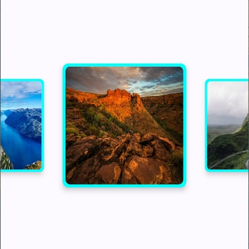
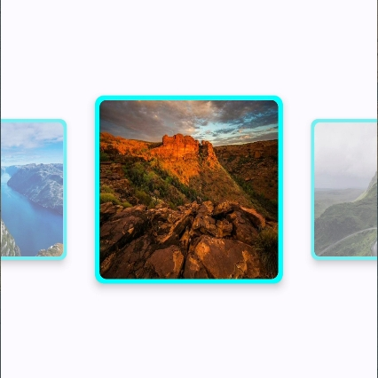

# Gallery
Comparison of gallery effects using ViewPager2 in AndroidX and HorizontalPager in Compose. For Compose projects, just copy the code in the compose folder. For non-Compose projects, just copy the code in the viewpager2 folder.
[中文说明](https://github.com/YangSion/Gallery/blob/master/README2.md)

## HorizontalPager implementation effect(Compose project recommended, very little code)
|gif          |static       |alpha        |
| ----------- | ----------- | ----------- |
|  |  |  |

## ViewPager2 implementation effect
|gif          |static       |alpha        |
| ----------- | ----------- | ----------- |
|  |  |  |
