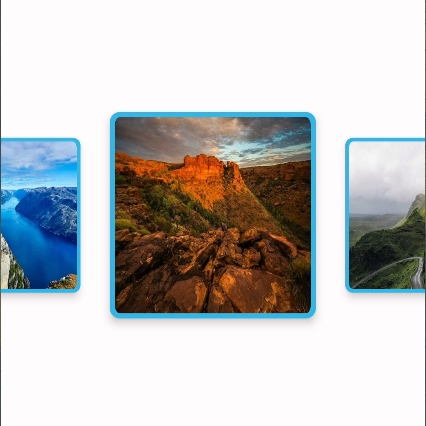

# Gallery 画廊
使用 AndroidX 中的 ViewPager2 与 Compose 中的 Horizo​​ntalPager 实现的画廊效果比较。Compose项目直接复制compose文件夹中代码即可，非Compose项目直接复制viewpager2文件夹中代码。
[English guide](https://github.com/YangSion/Gallery/blob/master/README.md)

## HorizontalPager 实现效果（Compose项目推荐，代码量极少）
|gif          |截图       |带透明度效果截图        |
| ----------- | ----------- | ----------- |
|  |  |  |

## ViewPager2 实现效果
|gif          |截图       |带透明度效果截图        |
| ----------- | ----------- | ----------- |
|  |  |  |
